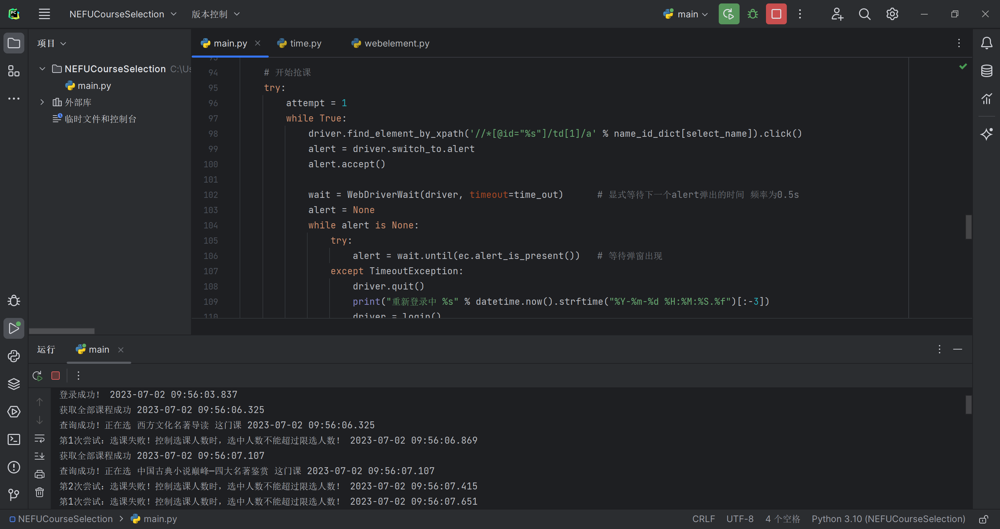
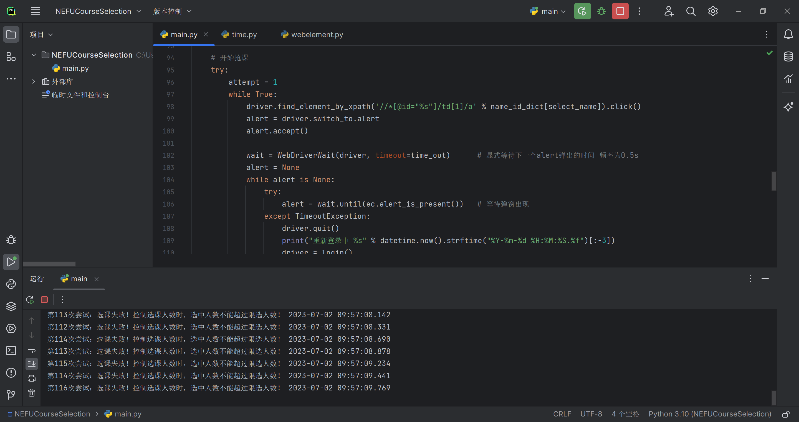

# NEFU Fuxk Courses Selection

这是一个使用 selenium 编写的一个简单的林带选课脚本，实现了多线程模拟点击自动登录，以及批量数据爬取的功能。

# 使用方法

以 Windows 为例：

## 环境配置

首先需要简单的环境配置：

1. [下载脚本:](https://github.com/ittuann/NEFU-CoursesSelection/releases/latest) <https://github.com/ittuann/NEFU-CoursesSelection/releases/latest>

2. 需要 Python 环境，然后安装`Selenium`

   ```python
   pip install selenium
   ```

3. 然后需要下载 `Chrome Driver`

   打开 <https://chromedriver.chromium.org/downloads> 网页，找到适合的版本然后下载`chromedriver_win32.zip`

4. 将压缩包解压，并复制`chromedriver.exe`的路径

5. 修改脚本第16行`driver_path`变量，将路径更换成刚刚复制的内容。

   例如，把默认的内容

   ```python
   driver_path = r"C:\Download\chromedriver_win32\chromedriver.exe"
   ```

   修改为

   ```python
   driver_path = r"D:\chromedriver.exe"
   ```

## 运行脚本

首先在Windows中搜索并打开 “命令提示符”

然后进入到脚本所在文件夹（文件夹的路径需要替换成你自己的）

```shell
cd C:\Users\Download\NEFUCourseSelection
```

之后即可运行脚本。

```shell
python main.py
```

脚本需要依次输入学号、密码、选课页面的网站、课程名称、是否使用WebVPN

1. 选课页面的网站需要在教务系统中手动获得。在 `培养管理 -> 选课中心` ，复制`[进入选课]`的链接并粘贴到脚本即可。
2. 课程名称可以输入单个或多个，每行一个名称。
3. 是否使用WebVPN，取决于是否在校园网内。如果没连接校园网则必须使用，在校园网内则都可以。

脚本的原理简单来说就是每0.5s左右轮询来选一次这门课，检查是否有同学退课。或是当有奸商在尝试退掉课程准备去卖课的时候时，脚本也能以尽快的速度选上。如果网页长时间没有反应被弹出则自动重新登录。我测试的是在暑期小学期来抢通识教育选修课，挂一天抢到的概率还是蛮大的。

脚本对于每个课程都创建了一个独立的线程来抢课。当然也可以同时运行多个。

最后，使用脚本后果自负，以及Fuxk抢课来卖的同学

# 运行截图




